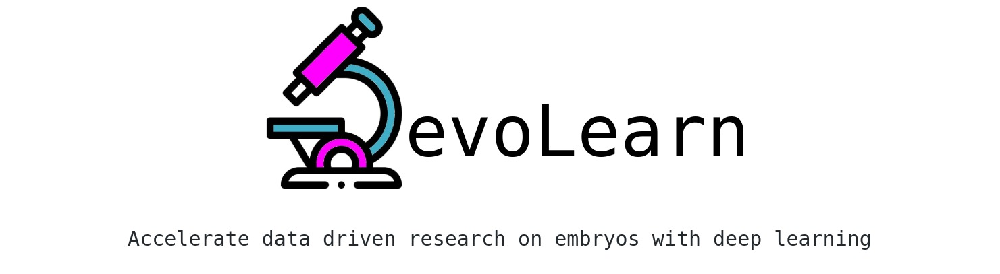

<p align="center">

</p>

## Segmenting the C. elegans embryo 


* Importing the model
```python
from devolearn import embryo_segmentor
segmentor = embryo_segmentor()

```

* Running the model on an image and viewing the prediction
```python
seg_pred = segmentor.predict(image_path = "sample_data/images/seg_sample.jpg")
plt.imshow(seg_pred)
plt.show()
```

* Running the model on a video and saving the predictions into a folder 
```python
segmentor.predict_from_video(video_path = "sample_data/videos/seg_sample.mov")
```

## Generating synthetic images of embryos with a Pre-trained GAN


* Importing the model
```python
from devolearn import Generator, embryo_generator_model
generator = embryo_generator_model()

```

* Generating a picture and viewing it 
```python
gen_image = generator.generate()  
plt.imshow(gen_image)
plt.show()

```

* Generating n images and saving them into `foldername` with a user set size 

```python
generator.generate_n_images(n = 5, foldername= "generated_images", image_size= (700,500))
```

---

## Predicting populations of cells within the C. elegans embryo


*  Importing the population model for inferences 
```python
from devolearn import lineage_population_model
```

* Loading a model instance to be used to estimate lineage populations of embryos from videos/photos.
```python
model = lineage_population_model(mode = "cpu")
```

* Making a prediction from an image
```python
print(model.predict(image_path = "sample_data/images/embryo_sample.png"))
```

* Making predictions from a video and saving the predictions into a CSV file
```python
results = model.predict_from_video(video_path = "sample_data/videos/embryo_timelapse.mov", save_csv = True, csv_name = "video_preds.csv", ignore_first_n_frames= 10, ignore_last_n_frames= 10 )
```

* Plotting the model's predictions
```python
plot = model.create_population_plot_from_video(video_path = "sample_data/videos/embryo_timelapse.mov", save_plot= True, plot_name= "plot.png", ignore_last_n_frames= 0 )
plot.show()
```
