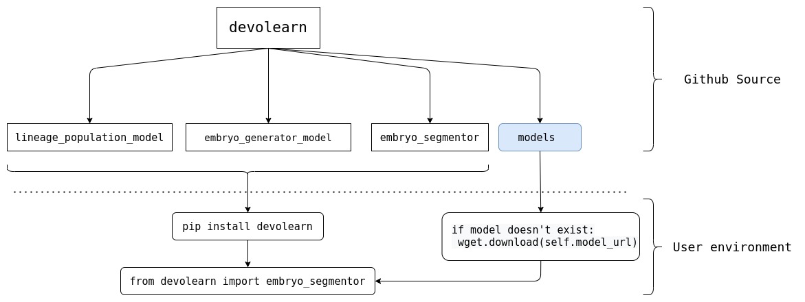

# Pre-trained Models That Enable Computational Developmental Biology
Mayukh Deb 1, 2, Ujjwal Singh 1, 3, Bradly Alicea 1, 4 
  1OpenWorm Foundation    
  2Amrita Vishwa Vidyapeetham University  
  3IIIT Delhi    
  4Orthogonal Research and Education Lab

## Abstract
TBA 

## Summary
Extracting metadata from microscopic videos/images have been one of the key steps in the process of finding emerging patterns from various biological processes. There have been many attempts to develop segmentation tools for cell shape and location (Cao, 2019a; Cao, 2019b; Chen, 2013). In particular, cell tracking methodologies provide quantitative summaries of cell centroid positions within an embryo (Ulman, 2006). Our pre-trained models (Devolearn) aim to speed up this process of collecting metadata by using robust deep learning models that can be used through a high level API. Devolearn’s primary focus is the _Caenorhabditis elegans_ embryo and specifically on the early embryogenesis process. This builds upon desired functionality that was first proposed by the DevoWorm group in (Alicea, 2019). Below are some of the capabilities of the DevoLearn model.

* **Segments images/videos of the _C. elegans_ embryo** and extract the centroids of the cells and save them into a CSV file.  

* **Estimating the population of cells of various lineages within the _C. elegans_ embryo** and upon user request generates plots of the data.  

* **Generating images of the _C. elegans_ embryo with a Generative Adversarial Network (GAN) (beta)**.  

DevoLearn has been made available as an open-source module, available on PyPI ([https://pypi.org/project/devolearn/](https://pypi.org/project/devolearn/)). All the deep-learning models used in devolearn are built and trained on PyTorch. The PyPI package itself does not contain the model weights, but the models are downloaded automatically once the user imports a certain model from the package. 

### Technical Details  
DevoLearn 0.2.0 is optimized to segment and analyze high-resolution microscopy images such as those acquired using light sheet microscopy. The deep learning models used for embryo segmentation and cell lineage population prediction were both based on the ResNet18 architecture. Data from the EPIC dataset (Murray, 2012) was used to train the GAN (beta) and the lineage wise cell population prediction model. The embryo segmentation model was trained on a dataset sourced from Cao (2019b).

## Statement of Need
Devolearn (0.2.0) is a Python package that aims to automate the process of collecting metadata from videos/images of the _C. elegans_ embryo with the help of deep learning models \autoref{fig:1}. This would enable researchers/enthusiasts to analyse features from videos/images at scale without having to annotate their data manually. There are a number of pre-trained models which are already in use in different contexts, but options are fewer within the unique feature space of developmental biology, in particular. Devolearn aims not just to fix this issue, but also work on other aspects around developmental biology with species-specific models.  

  
DevoLearn is also capable of extracting _meta-features_ that identify movement patterns and multicellular physics in the embryogenetic environment. Examples of this include embryo networks (Alicea and Gordon, 2018) and motion features. The former capability involves extracting potential structural and functional networks using distance metrics and other information extracted from microscopy images. Motion features can also be extracted and can be used for a variety of purposes, including as a means to build generative adversarial network (GAN) models (Goodfellow, 2014).

Devolearn has been built to be very data science friendly and to be highly compatible with libraries like NumPy (Harris, 2020) and Pandas (Virtanen, 2020) As the Devolearn framework \autoref{fig:2} grows bigger with more tools and deep learning models, the combination of beginner friendliness and support for data science functionality will enable exciting scientific explorations both in developmental biology and data science.   

The DevoLearn PyPI package is a part of the DevoLearn Github organization (https://github.com/devolearn), which serves as a comprehensive open-source research and educational resource. It aims to provide users with Data Science tutorials, web-based applications that offer other Deep Learning and Machine Learning tools for cell segmentation, and other educational resources.  We invite new collaborators to join us on a continual basis in maintaining and expanding the capabilities of the DevoLearn organization.  

## Acknowledgements
We would like to thank the OpenWorm Foundation, the International Neuroinformatics Coordinating Facility (INCF), and Google Summer of Code for their financial and institutional support. Gratitude also goes to the DevoWorm group for their expertise and feedback. 

## References
Alicea, B., Gordon, R., Kohrmann, A., Parent, J., and Varma, V. (2019). Pre-trained Machine Learning Models for Developmental Biology. _The Node blog_, October 29. doi:10.6084/m9.figshare.13347095.

Alicea, B. and Gordon R. (2018). Cell Differentiation Processes as Spatial Networks: identifying four-dimensional structure in embryogenesis. _BioSystems, 173_, 235-246.  

Cao, J., Guan, G., Wong, M-K., Chan, L-Y., Tang, C., Zhao, Z., and Yan, H. (2019a). Establishment of morphological atlas of _Caenorhabditis elegans_ embryo with cellular resolution using deep-learning-based 4D segmentation. _bioRxiv_, doi:10.1101/797688.

Cao, J., Wong, M-K., Zhao, Z., and Yan, H. (2019b). 3DMMS: robust 3D Membrane Morphological Segmentation of _C. elegans_ embryo. _BMC Bioinformatics_, 20, 176.

Chen, L., Hang Chan, L.L., Zhao, Z., and Yan, H. (2013). A novel cell nuclei segmentation method for 3D _C. elegans_ embryonic time-lapse images. _BMC Bioinformatics_, 14, 328.

Goodfellow, I.J., Pouget-Abadie, J., Mirza, M., Xu, B., Warde-Farley, D., Ozair, S., Courville, A., and Bengio, Y. (2014). Generative Adversarial Networks. _arXiv_, 1406.2661.

Hall, D.H. and Altun, Z.F. (2008). _C. elegans_ Atlas. Cold Spring Harbor Labratory Press, Woodbury, NY.

Harris, C.R. (2020). Array programming with NumPy. _Nature, 585_, 357-362.

Murray, J.I., Boyle, T.J., Preston, E., Vafeados, D., Mericle, B., Weisdepp, P., Zhao, Z., Bao, Z., Boeck, M., and Waterston, R.H. (2012). Multidimensional regulation of gene expression in the _C. elegans_ embryo. _Genome Research, 22_(7), 1282–1294.

Ulman, V. et.al (2017). An objective comparison of cell-tracking algorithms. _Nature Methods, 14_(12), 1141–1152.

Virtanen, P. et.al (2020). SciPy 1.0: Fundamental Algorithms for Scientific Computing in Python. _Nature Methods, 17_, 261-272.  
